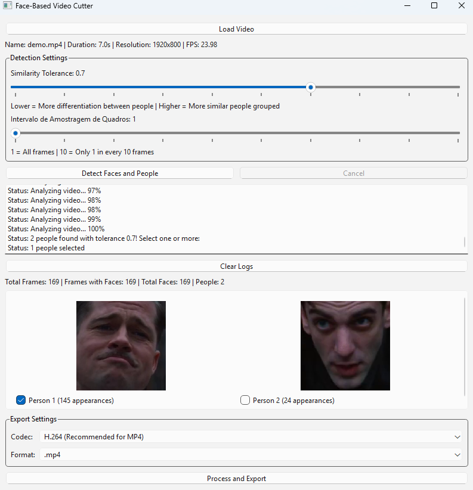

<h1 align="center">Face-Based Video Cutter</h1>

<div align="center">

[]()


[](https://github.com/MllGll/FaceBasedVideoCutter/blob/main/LICENSE)

</div>

<div align="center">



</div>

## Overview

Face-Based Video Cutter is a desktop application that allows you to easily cut and export video segments based on the presence of specific people in the footage. Leveraging face recognition technology, this tool provides an intuitive way to create personalized video compilations.

## Key Features

- 👤 Advanced face detection using machine learning
- 🎥 Support for multiple video formats (MP4, AVI, MOV, MKV)
- 🔧 Customizable face recognition tolerance and frame sampling interval
- 🖥️ User-friendly graphical interface
- 💾 Multiple export codec and format options

## Prerequisites

- Python 3.8 or higher
- pip (Python package manager)

## Installation

### 1. Clone the Repository

```bash
git clone https://github.com/MllGll/FaceBasedVideoCutter.git
cd FaceBasedVideoCutter
```

### 2. Create a Virtual Environment (Optional but Recommended)

```bash
# On Windows
python -m venv venv
venv\Scripts\activate

# On macOS/Linux
python3 -m venv venv
source venv/bin/activate
```

### 3. Install Dependencies

```bash
pip install -r requirements.txt
```

### 4. Run the Application

```bash
python src/face_based_video_cutter.py
```

## How to Use the Application

### 1. Load Video
- Click "Load Video"
- Select your input video file
- Video metadata will be displayed automatically

### 2. Configure Detection Settings
- Adjust "Similarity Tolerance" slider
  - Lower values: More differentiation between people
  - Higher values: More similar people grouped together
- Set "Frame Sampling Interval"
  - 1: Analyze all frames
  - 10: Analyze 1 frame out of every 10

### 3. Detect Faces
- Click "Detect Faces and People"
- Wait for processing to complete
- Thumbnails of detected people will appear

### 4. Select Persons to Include
- Check the checkboxes next to the person thumbnails
- Number of appearances will be shown
- Multiple persons can be selected

### 5. Export Settings
- Choose Video Codec
  - H.264 (Recommended for MP4)
  - XVID (Recommended for AVI)
  - Other specialized codecs available
- Select Output Format
  - .mp4
  - .avi
  - .mov
  - .mkv

### 6. Process and Export
- Click "Process and Export"
- Choose save location for output video
- Wait for processing to complete

## Troubleshooting

- Ensure all dependencies are installed correctly
- Check video codec compatibility
- Verify Python and library versions

## Performance Tips

- Lower frame sampling interval for more accurate detection
- Adjust face recognition tolerance for better results
- Use shorter video segments for faster processing

## Contributing

Contributions are welcome! Please follow these steps:

1. Fork the repository
2. Create your feature branch (`git checkout -b feature/AmazingFeature`)
3. Commit your changes (`git commit -m 'Add some AmazingFeature'`)
4. Push to the branch (`git push origin feature/AmazingFeature`)
5. Open a Pull Request

## License

Distributed under the MIT License. See [LICENSE](https://github.com/MllGll/FaceBasedVideoCutter/blob/main/LICENSE) for more information.

## Authors

- [@MllGll](https://github.com/MllGll) - Creator
